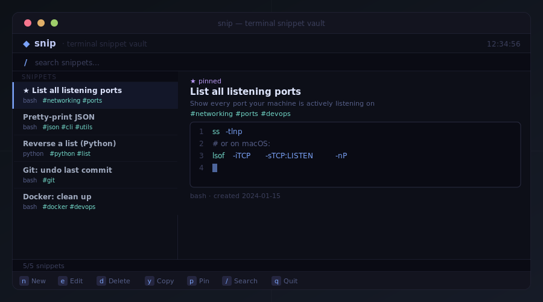

<div align="center">

<br/>

# ◆ snip

**Your code snippets. In your terminal. Always.**

Stop Googling the same one-liners. Stop losing clever commands to closed tabs.<br/>
snip is a fast, local, offline snippet vault that lives where you actually work.

<br/>

[](https://github.com/phlx0/snip/actions/workflows/ci.yml)
[](https://github.com/phlx0/snip/releases)
[](https://github.com/phlx0/snip/stargazers)
[](https://www.python.org)
[](LICENSE)
[](https://github.com/Textualize/textual)
[](#install)

<br/>



<br/>

</div>

---

## Why snip?

You write a clever one-liner. You close the terminal. Three weeks later you're Googling the same thing again.

**snip** fixes that. It's a personal snippet vault that runs entirely in your terminal — local, offline, zero-account, instantly searchable. Open it, find what you need, yank it to your clipboard, and get back to work.

No Electron. No browser. No sync drama. Just your snippets, always there.

---

## Install

### One-liner (Linux / macOS)

```bash
curl -fsSL https://raw.githubusercontent.com/phlx0/snip/main/install.sh | bash
```

Creates an isolated virtualenv at `~/.local/share/snip`, drops a `snip` launcher at `~/.local/bin/snip`, and patches your shell config if needed. Open a new terminal and you're done.

### From source

```bash
git clone https://github.com/phlx0/snip
cd snip
make dev    # creates .venv + installs with dev extras
make run    # launch
```

---

## Usage

```bash
snip                          # open the TUI
snip ports                    # copy snippet titled "ports" to clipboard
snip run deploy               # run a snippet as a shell command
snip --list                   # print all snippet titles
snip --list docker            # filter titles by tag
snip --add myscript.sh        # save a file as a snippet
snip --delete ports           # delete a snippet without opening the TUI
snip --json ports             # output snippet as JSON (great for scripting)
snip --export > backup.json   # export all snippets to JSON
snip --import backup.json     # import snippets from JSON
snip --from-history           # pick a command from shell history and save it
snip --version                # show version
snip -q ports                 # suppress informational output (clean for scripts)
snip --db ~/sync/snip.db      # use a custom db — easy cloud sync
snip theme list               # list available themes
snip theme set dracula        # switch to the Dracula theme
snip theme import my.json     # import a custom theme and activate it
snip --theme dracula          # one-shot: use a theme for this session only
```

### Shell completion

```bash
# zsh — add to ~/.zshrc
eval "$(snip init zsh)"

# bash — add to ~/.bashrc
eval "$(snip init bash)"
```

`snip <TAB>` will autocomplete snippet titles and flags.

### fzf integration

```bash
snip --list | fzf | xargs snip
```

Pick any snippet interactively with fuzzy search, pipe it straight to your clipboard.

---

## Features

| | |
|---|---|
| **Instant CLI lookup** | `snip <query>` copies a snippet without opening the TUI |
| **Run as command** | `snip run <query>` runs a snippet directly in your shell |
| **Import from file** | `snip --add script.sh` saves any file as a snippet, language auto-detected |
| **Export / import** | `snip --export` / `snip --import` — JSON backup, perfect for dotfiles |
| **Shell history mining** | `snip --from-history` — pick a command from your history and save it |
| **Tag filtering** | `snip --list docker` — filter titles by tag from the CLI |
| **JSON output** | `snip --json <query>` — full snippet metadata as JSON for scripting |
| **Shell completion** | `eval "$(snip init zsh)"` — tab-complete snippet titles and flags |
| **fzf-friendly** | `snip --list` prints titles one per line — pipe into anything |
| **Themes** | Built-in Tokyo Night and Dracula; import any custom theme via a JSON file |
| **Syntax highlighting** | Syntax colors adapt to the active theme across 20+ languages |
| **Live search** | Filters across title, description, tags, and language as you type |
| **Clipboard copy** | Press `y` to yank a snippet straight to your clipboard |
| **Pin snippets** | Keep your most-used snippets pinned at the top |
| **Tags** | Organise freely — `#docker #devops #git` etc. |
| **Vim-style navigation** | `j`/`k` or arrow keys, `/` to search, `q` to quit |
| **SQLite storage** | Lives in `~/.config/snip/snip.db` — portable, zero-dependency |
| **Fully offline** | No server, no account, your data stays local |

---

## Keyboard shortcuts

| Key | Action |
|-----|--------|
| `n` | New snippet |
| `e` | Edit selected snippet |
| `d` | Delete selected snippet |
| `y` | Copy content to clipboard |
| `p` | Toggle pin |
| `/` | Focus search bar |
| `Esc` | Clear search / return to list |
| `↑` `↓` or `j` `k` | Navigate list |
| `q` | Quit |

---

## Project structure

```
snip/
├── assets/
│   └── hero.svg
├── snip/
│   ├── __main__.py          # entry point + CLI
│   ├── app.py               # Textual app + demo seeding
│   ├── themes.py            # theme system — built-ins, JSON loading, CSS injection
│   ├── snip.tcss            # all styling (CSS variables, theme-agnostic)
│   ├── models/
│   │   └── snippet.py       # Snippet dataclass
│   ├── storage/
│   │   └── database.py      # SQLite CRUD
│   ├── ui/
│   │   ├── screens/
│   │   │   ├── main_screen.py
│   │   │   └── edit_screen.py
│   │   └── widgets/
│   │       ├── app_header.py
│   │       ├── snippet_list.py
│   │       └── snippet_preview.py
│   └── utils/
│       └── clipboard.py
├── tests/
├── install.sh               # Linux / macOS installer
├── Makefile
└── pyproject.toml
```

---

## Development

```bash
make dev        # create .venv + install with dev extras
make test       # run test suite
make test-cov   # run with coverage report
make run        # launch the app
make clean      # remove build artefacts and .venv
```

---

## Docs

Full documentation is available on the [**wiki**](https://github.com/phlx0/snip/wiki).

- [CLI reference](https://github.com/phlx0/snip/wiki/CLI-Reference)
- [Themes](https://github.com/phlx0/snip/wiki/Themes)
- [Keybindings](https://github.com/phlx0/snip/wiki/Keybindings)
- [fzf integration](https://github.com/phlx0/snip/wiki/FZF-Integration)
- [tmux integration](https://github.com/phlx0/snip/wiki/Tmux-Integration)
- [Shell completion](https://github.com/phlx0/snip/wiki/Shell-Completion)
- [Scripting with snip](https://github.com/phlx0/snip/wiki/Scripting)
- [Dotfile sync](https://github.com/phlx0/snip/wiki/Dotfile-Sync)
- [Tips & tricks](https://github.com/phlx0/snip/wiki/Tips-and-Tricks)

---

## Contributing

Bug reports and pull requests are welcome on [GitHub](https://github.com/phlx0/snip/issues).

1. Fork the repo and create a branch: `git checkout -b fix/my-fix`
2. Make your changes and add tests if relevant
3. Run `make test` to make sure everything passes
4. Open a pull request

---

## License

MIT — see [LICENSE](LICENSE).
